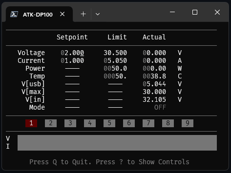
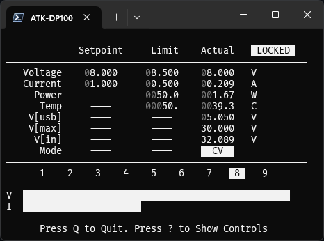
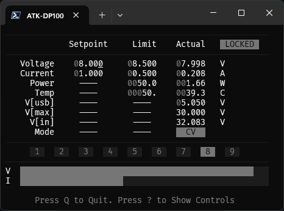
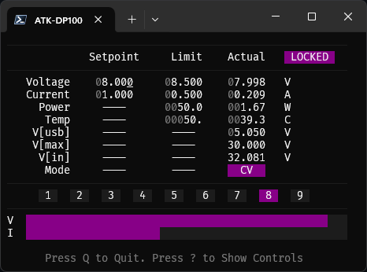
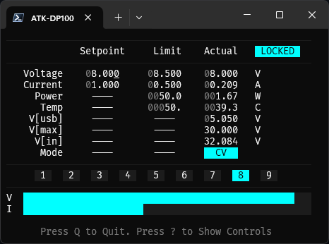
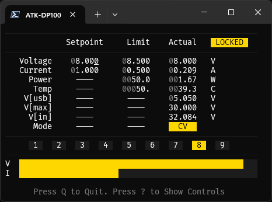

# VICON: Power Controller

[](https://github.com/jjcarrier/vicon/actions/workflows/ci.yml)

> [!WARNING]
> This repository is in an early release state and is subject to breaking
> changes, faulty behavior, and/or incomplete functionality. Please use extra
> caution while in this state. There is no guarantee that the functionality
> currently provided will remain compatible/available in future revisions. With
> that said, feedback/suggestions/bug reports are very much welcome and should
> be issued via a GitHub issue. It is highly recommended to review the issues
> page prior to use to understand any known issues with the tool so you may
> assess the risk of using this while in this early release state.

<!-- markdownlint-disable -->
<p align="center">
  
</p>
<!-- markdownlint-enable -->

## Description

`vicon` : (vī'con) Short for V-I-Console and a play on the pronunciation of viking.

A CLI/TUI for controlling the AlienTek DP100 (ATK-DP100) over USB.

## Checklist / Features

Below is a basic overview of `vicon` functionality:

- [x] CLI supported
  - Serial processing of commands, allowing for complex control sequences.
  - Normal-style and JSON-style output to provide option for human readability
    and tool integration.
- [x] Text-UI (TUI) supported
  - A streamlined text-based user interface providing control with minimal and
    intuitive keystrokes.
- [x] Waveform Generator (AWG)
  - A basic JSON file format is used to describe setpoint sequences for
    generating arbitrary waveforms (low speed).
- [x] Suppressed ATK-DP100DLL debug output
- [x] Wireshark USB dissector
- [x] PowerShell tab-completions
- [x] JSON output
  - Providing a convenient way to integrate with other tooling.
- [x] Serial command line processing
  - For most options/commands, the order in which they are specified in the
    command argument list determine the execution order. This aids in simple
    scripting for automated workloads.
- [x] Multi-device supported
  - Mechanisms such as `--enumerate` and `--serial` improve user experience when
    working with multiple DP100s.
- [x] Supports a TUI lock function to prevent accidental button presses
- [x] Supports basic TUI theme option for user to select from one of the pre-defined
  color themes.
- [ ] Recorder/trace (support for logging all activity during interactive mode)

## Software Requirements

- Requires .NET Framework (v4.8.1)
  - `winget install Microsoft.DotNet.Framework.DeveloperPack_4`
    - NOTE: A system reboot is recommended after install.
  - A future version will hopefully switch to .NET Core to make this tool
    cross-platform.
- Visual Studio 2022 / MSBuild / NuGet
  - Visual Studio `.NET desktop environment` workload.
  - Dedicated nuget install: `winget install Microsoft.NuGet`.

## Initial Setup

Checkout and configure the repository via:

```pwsh
git clone --recurse-submodules https://github.com/jjcarrier/vicon.git
cd vicon
nuget restore
```

> [!NOTE]
> If the `--recurse-submodules` option was skipped in the clone step, please run
> the following prior to continuing:
> `git submodule update --init --recursive`

Build the project via:

```pwsh
dotnet build
```

Add the build directory to your PowerShell `$PROFILE` to make the command
available from any directory.

Run the follow command for help documentation:

```pwsh
vicon --help
```

## CLI Examples

<details>
  <summary>Read Output Configs</summary>

This example shows how to read out the various configurable parameters of the device.

```pwsh
vicon --read-sys --read-out --read-pre 0 10 --json
```

```output
{"Command":"ReadSystem","Response":{"SystemParams":{"OPP":30,"OTP":60,"RPP":true,"AutoOn":false,"Backlight":1,"Volume":2}}}
{"Command":"ReadOutput","Response":{"Output":{"On":false,"Preset":0,"Setpoint":{"Voltage":3300,"Current":300,"OVP":8125,"OCP":250}}}}
{"Command":"ReadPreset","Response":{"Index":0,"Preset":{"Voltage":3300,"Current":300,"OVP":8125,"OCP":250}}}
{"Command":"ReadPreset","Response":{"Index":1,"Preset":{"Voltage":3300,"Current":200,"OVP":3500,"OCP":500}}}
...
{"Command":"ReadPreset","Response":{"Index":9,"Preset":{"Voltage":10000,"Current":5000,"OVP":30500,"OCP":5050}}}
```

</details>

<details>
  <summary>Basic Control</summary>

This example sets the output to 3.3V and a max current of 500mA. Afterwards,
delay for 500ms and then turn the output on, delay for 5 seconds and finally
turn the output off. All commands and responses are output in JSON format.

```pwsh
vicon --mv 3300 --ma 500 --delay 500 --on --delay 5000 --off --json
```

```output
{"Command":"WriteVoltage","Response":{"Voltage":3300,"Current":500,"OVP":8125,"OCP":250}}
{"Command":"WriteCurrent","Response":{"Voltage":3300,"Current":500,"OVP":8125,"OCP":250}}
{"Command":"WriteOutputOn","Response":{"On":true}}
{"Command":"WriteOutputOff","Response":{"On":false}}
```

</details>

<details>
  <summary>Monitoring Output</summary>

This example is a more involved example showing how one may read data from the
JSON output and convert it into a tabular form using PowerShell cmdlets. This
primarily serves to illustrate how PowerShell may be used as glue logic between
two CLI utilities to perform a more complicated task.

```pwsh
vicon --off --delay 1000 --mv 7500 --ma 400 --on --ra 50 1 --json | `
  ForEach-Object { $_ | ConvertFrom-Json } | `
  Where-Object { $_.Command -eq 'ReadActState' } | `
  Select-Object -ExpandProperty Response | `
  Select-Object -ExpandProperty ActiveState | `
  Select-Object -Property Timestamp,FaultStatus,OutputMode,Voltage,Current | `
  Format-Table
```

```output
Timestamp        FaultStatus OutputMode Voltage Current
---------        ----------- ---------- ------- -------
11:50:50.6286131           0          0     285      61
11:50:50.6421596           0          1    6432     188
11:50:50.6574657           0          1    7087     148
11:50:50.6719755           0          1    7296     108
11:50:50.6871800           0          1    7399      79
11:50:50.7029259           0          1    7450      56
11:50:50.7182109           0          1    7472      41
11:50:50.7325633           0          1    7482      30
11:50:50.7484842           0          1    7486      23
11:50:50.7635261           0          1    7488      18
11:50:50.7795500           0          1    7490      14
11:50:50.7959834           0          1    7491      17
11:50:50.8123372           0          1    7492      19
...
```

</details>

## Interactive Mode (TUI)

A fully featured text user interface (TUI) is available via the `--interactive`
option.

```pwsh
vicon --interactive
```

<!-- markdownlint-disable -->
<p align="center">
  
</p>
<!-- markdownlint-enable -->

> [!IMPORTANT]
> The `Ctrl + C` keystroke will immediately exit interactive-mode but will allow
> for post-interactive commands to execute. This way, a safe series of operations
> may be performed at conclusion of this mode regardless of whether the user
> exits with `q` keystroke or `Ctrl + C`.

### TUI Overview

#### Columns

The Text-Based User Interface (TUI) consists of three primary columns of
information.

| Column   | Description                                                       |
|----------|-------------------------------------------------------------------|
| Setpoint | Responsible for setting the desired voltage and current levels on the output. |
| Limit    | Responsible for setting the desired limits for voltage (OVP), current (OCP), power (OPP), and temperature (OTP). OVP and OCP are applied at a per-preset level and are not automatically applied (i.e. the user must issue `Alt + 0-9` to store/apply the value). When these values are modified, the data entry will blink to indicate that the modified value has not been applied to the device. For OPP and OTP, these are applied at the system-level and are applied immediately. If for whatever reason these are not applied, the value will also blink. |
| Actual   | Reports the actual values sensed/reported by the device. |

#### Presets

Below the tabular data of the TUI is a row of numbers from `0`-`9`. These
represent the presets. The one that is highlighted represents the currently
loaded preset, though the `voltage` and `current` values stored in this preset
may differ from the values currently set on the output. To load/recall a preset
simply involves pressing the corresponding number. If the output is currently `ON`
the output will switch to `OFF`.

> [!NOTE]
> It is possible during transition from one preset to another that `OVP`/`OCP`
> faults trigger. In favor of keeping the UI responsive only moderate delay
> logic has been applied to mitigate the majority of these events, but the
> time required for completely mitigating the issue is in the realm of seconds.

#### Bar Graphs

At the bottom of the interface are two bar graphs that represent the voltage
and current output levels in respect to their corresponding limits (`OVP`/`OCP`).

If `V[max]` is below `OVP` then this is considered the referenced voltage
limit.

This graph uses special characters to provide high-resolution display
allowing the user to visually detect fluctuations in the outputs and how much
margin there is between the corresponding limits.

#### Fault State

When a fault occurs the corresponding fault status will be prominently displayed
in the top left of the interface. Depending on the applied-theme, the UI color
scheme may switch to further differentiate this state from the normal state.

#### Locked State

The TUI supports a locked state enabled via `Ctrl + Shift + L`. This prevents
accidental modification of the output while `LOCKED` is displayed in the top right
of the interface. Depending on the applied-theme, the UI color scheme may switch
to further differentiate this state from the normal state.

#### AWG Mode

Similar to the `LOCKED` state, the `AWG` will be presented in the top right of
the interface. While in the mode most interactive functionality is disabled.
The arbitrary waveform generation logic is solely driven by the loaded json
configuration.

#### Non-Volatile Parameters

When non-volatile parameters are modified, the corresponding elements in the TUI
will start to blink and remain in this state until the values have actually been
written to non-volatile memory. This is done automatically with system
parameters, but for `presets` the user must manually save the presets via the
corresponding `Alt + 0-9` key stroke.

#### Themes

Currently themes are provided via predefined configurations. A future update may
introduce customizable themes.

The below are the basic themes available. More may be defined in future updates,
see `--help` for more details on the `--theme` option.

- `classic`
  The (mostly) original theme used in this application. Offers mixed coloring to
  help convey operating status.
- `black-and-white`
  A (mostly) black-and-white option that is perhaps the best option for terminal
  compatibility.
- `grey`
  A monotone color palette, for those that like to keep things simple.
- Various color-accented themes:
  - `dark-red`, `dark-green`, `blue`, `blue-violet`, `dark-magenta`, `cyan`, `gold`

<!-- markdownlint-disable -->
<p align="center">
  
  
  
  
  
</p>
<!-- markdownlint-enable -->

## Additional

### Tab-Completions

A tab-completer is available in the `completion` folder, offering an improved
user-experience. This module leverages [PS-HelpParser](https://github.com/jjcarrier/PS-HelpParser)
to automatically parse the help documentation and provide tab-completion results
to the user.

The completion file is provided in:

```pwsh
./completion/VIConCompletion.psm1
```

With the `HelpParser` module installed via
[PSGallery](https://www.powershellgallery.com/packages/HelpParser) import both
the parser and the completion module via:

```pwsh
Import-Module HelpParser
Import-Module <full_path_to_file>/VIConCompletion.psm1
```

Add the above to your `$PROFILE` to make the changes persist between sessions.

### WireShark Dissector

A Lua dissector is provided in the `./wireshark/` directory.
This dissector offers a way to debug and investigate behavior of the ATK-DP100's
HID interface.

## License

Copyright © Jon Carrier

This project is licensed under the MIT license. For more details please refer to
[LICENSE](./LICENSE). This software depends on the following third party
components:

- Spectre.Console (https://github.com/spectreconsole/spectre.console/LICENSE.md)
- HidSharp (https://github.com/IntergatedCircuits/HidSharp/blob/master/License.txt)
